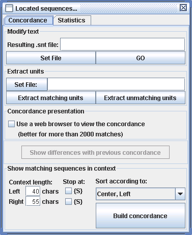
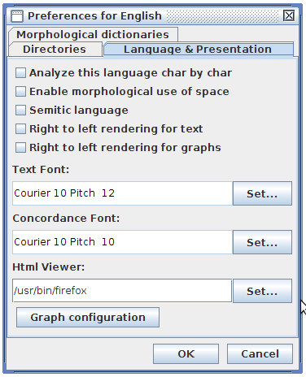
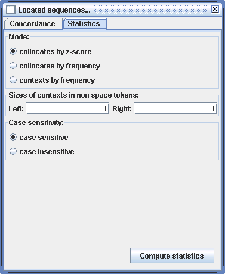

正则表达式搜索
==============

本章介绍了如何使用正则表达式来搜索文本的简单模式。

定义
----

本章的目的不是对正式语言的介绍，而是展示了如何在
Unitex中使用正则表达式，来查找简单的模式。感兴趣的读者可以参考更多相关作品。

一个正则表达式,又称正规表示法, 可以表示为:

-  一个标记token (``书``)或者一个词汇掩模 (``<吃.V>``);

-  在文本中的特定位置： 开始\ ``{^}``\ 或结尾 ``{$}``

-  两个正则表达式的连接 (``我 吃``);

-  两个正则表达式的结合(\ ``Pierre+Paul``);

-  Kleene星号的正则表达式 (``très*``).

词汇单位
--------

在一个正则表达式， 词汇单位token的定义在 [tokenization] (page ).
说明了句号，加号，星号，小于号，开，闭括号，�和双引号有特殊意义，因此，有必要在它们前面加上一个转义字符\ ``\``\ 如果你要寻找他们。下面是单位词正确的一些例子：

::

    chat
    \.
    <N:ms>
    {S}

默认情况下, Unitex被设置为让小写模式也能找到大写并与其匹配。
可以使用引号来强制区分大小写。 因此, ``"pierre"`` 只能识别 ``pierre``
而不能识别 ``Pierre`` 和 ``PIERRE``\ 。

注意：为了使空间强制性的，它需要用引号括起来。

词汇掩模
--------

词汇掩模是标记或一串标记对应的搜索查询。

特殊符号
~~~~~~~~

有两种词汇掩模。第一种介绍章节在 [section-sentence-splitting],包含 除了
``<PNC>`` 和 ``<^>``. (符号 ``<PNC>``\ 的特殊符号和元符号,
能够匹配标点符号, 只有在预处理阶段有效 ; ``<^>``
匹配换行，但当所有的换行都被空间替换？？？？，此符号在搜索词汇掩模时就不适用了。)
可用于搜索文本的模式的元符号的情况如下～:

-  ``<E>`` : 空词, 或者ε。识别出空序列;

-  ``<TOKEN>`` : 识别任何标记除了默认用于形态滤波器的空间;

-  ``<WORD>`` : 识别任何字母组成的词汇掩模;

-  ``<LOWER>`` : 识别任何小写字母组成的词汇掩模;

-  ``<UPPER>`` : 识别任何大写字母组成的词汇掩模;

-  ``<FIRST>`` : 识别任何首字母大写组成的词汇掩模;

-  ``<DIC>`` : 识别任何出现在文本字典的词;

-  ``<SDIC>`` : 识别任何出现在文本字典的单词;

-  ``<CDIC>`` : 识别任何出现在文本字典的复合词;

-  ``<TDIC>`` : 识别任何标签标记比如 ``{XXX,XXX.XXX}``;

-  ``<NB>`` : 识别任何连续的数字串 (1234 可以被识别 但是 1 234不可以) ;

-  ``#`` :禁止的空间的存在。

对应旧代码 ``<WORD>``, ``<LOWER>``, ``<UPPER>`` 和 ``<FIRST>`` 分别是
``<MOT>``, ``<MIN>``, ``<MAJ>`` 和 ``<PRE>``.
它们仍然可以使用，以保持现有图形的系统兼容性,但是现在它们是过时的,也就是说为了最新版本的运行，我们建议避免它们的使用在图形设计中 [1]_,
为了避免不必要的词汇掩模使用的增加。

NOTE : 如章节 [tokenization]所述,任何métas都不能用来识别标记 ``{STOP}``,
``<TOKEN>``\ 也不能。

参考字典提供的信息
~~~~~~~~~~~~~~~~~~

第二种词汇掩模包括来那些能够查找文本字典的信息。四种可能的形式是 :

-  ``<lire>``: 识别所有包含 ``lire``\ 的词条 作为标准形式。
   我们说这张形式是歧义的，如果 ``lire``
   是一个语法代码同时又是一个语义代码;

-  ``<lire.>``: 识别所有包含 ``lire``\ 的词条作为标准形式。
   这个词汇掩模在上一种情况中不是歧义的;

-  ``<be.V>``: 识别所有包含
   ``lire``\ 和语法代码\ ``V``\ 的词条，作为标准形式;

-  ``<V>``: 识别所有包含语法代码 ``V``\ 的词条。
   这个词汇掩模是歧义的如同第一种情况。 为了消除歧义性, 我们可以使用
   ``<.V>`` 或者\ ``<+V>``;

-  ``{lirons,lire.V}`` 或者 ``<lirons,lire.V>``: 识别所有包含
   ``lir-``\ ``ons`` 的词条作为屈折形式,包含
   ``lire``\ 的词条作为标准形式和包含语法代码 ``V``.
   如果您在文本自动机进行了说明词的多义性工作，这种类型的词汇掩模是唯一有用。
   当我们搜索一篇文章时, 这个掩模和标记 ``lirons``\ 识别相同的东西。

语法和语义约束
~~~~~~~~~~~~~~

前面的词汇掩模的例子是简单的。为了表达更为复杂的模式，在语法，语义代码中间用\ ``+``\ 分隔开。如果有很多代码,
符号 ``+`` 可以解释成
‘’和’’ :在字典中一个词条只有当它所有的代码都包括在掩模中，才能被识别。
掩模\ ``<N+z1>`` 识别这些词条 :

``broderies,broderie.N+z1:fp``

``capitales européennes,capitale européenne.N+NA+Conc+HumColl+z1:fp``

不识别:

``Descartes,René Descartes.N+Hum+NPropre:ms``

``habitué,.A+z1:ms``

我们可以排除代码，让在它之前加上字符\ ``~`` 而不用 ``+``.
为了被识别,一个词条必须包括所有掩模所要求的代码, 不包含任何它禁止的代码.
举个例子, ``<A~z3>``
识别所有包含代码\ ``A``\ ，而不包含代码\ ``z3``\ 的词条 (cf.
table [tab-semantic-codes]) [2]_. 如果我们想要搜索一个包含字符
``~``\ 的代码,我们需要在它前面加一个字符\ ``\``.

注：2.1版本之前，否定运算符是减号。如果想 要
使用旧图不加修改，需要在命令行加\ ``Locate``\ 和操作\ ``-g minus``\ 。

词汇掩模的句法在语法码(table [tab-grammatical-codes])和语义码(table [tab-semantic-codes])之间没有差别。在DELAF电子词典里，语法码是那些出现在第一个和编码语法范畴，但在Unitex的词汇掩模中，语法码和语义码的出现顺序不重要。以下三个词汇掩模是等价的：

::

    <N~Hum+z1>
    <z1+N~Hum>
    <~Hum+z1+N>

一个词汇掩模可以包含语义码而没有语法范畴的代码。

注意：使用只有禁止码的掩模是不可以的。 ``<~N>`` 和
``<~A~z1>``\ 是不正确的掩模。但是，你可以运用上下文解释这个约束。(见章节 [section-contexts]).

屈折限制
~~~~~~~~

另外，也可以指定有关屈折代码约束。这些限制都必须先通过至少一个语法或语义代码。他们遵循相同格式的约束，由字典中的屈折代码组成。
以下是一些使用屈折限制的词汇掩模的例子：

-  ``<A:m>`` 识别一个阳性的形容词 ;

-  ``<A:mp>`` 识别一个阳性复数形容词。

屈折代码由字母引入\ ``:``\ 有一个或多个字母构成，而且每个字母传达一个信息。先从一个单独屈折代码组成的词汇条目和掩模的简单情况开始。为了词条条目
:math:`E`\ 被掩模\ :math:`M`\ 识别,需要\ :math:`E`\ 的
屈折代码中包含了\ :math:`M`\ 的屈折代码中的所有字符 :

:math:`E`\ =\ ``sépare,séparer.V:Y2s``

:math:`M`\ =\ ``<V:Y2>``

:math:`E`\ 的\ ``Y2s`` 包括字符\ ``Y`` 和 ``2``\ 。
:math:`E`\ 至少包括一个\ ``Y2``, 词汇掩模 :math:`M` 识别条目
:math:`E`\ 。

。所有的语法和语义代码必须先于屈折代码。

如果几个屈折码存在于一个词法掩模, 符号 ``:`` 表示 ‘’或’’ :

-  ``<A:mp:f>`` 同时匹配 ``<A:mp>``\ 和 à ``<A:f>`` ;
   它识别要么阳性复数形容词，要么阴性形容词 ;

-  ``<V:2:3>``
   识别第2人称或第3人称;排除了既没有第二或第三人称（不定式，过去分词和现在分词）的所有时态以及以第一人称变位的时态。

为了一个字典词条 :math:`E`
被掩模\ :math:`M`\ 识别,需要\ :math:`E`\ 中的至少
一个屈折代码包含\ :math:`M`\ 的至少一种屈折代码的所有字符。
考虑以下的例子:

:math:`E`\ =\ ``sépare,séparer.V:W:P1s:P3s:S1s:S3s:Y2s``

:math:`M`\ =\ ``<V:P2s:Y2>``

没有同时包含\ ``P``, ``2``\ 和\ ``s``\ 的屈折代码
:math:`E`\ 。然而,\ :math:`E`\ 代码\ ``Y2s`` 却包含字符 ``Y`` 和
``2``\ 。代码 ``Y2`` 至少包括一个代码\ :math:`E`,因此词汇掩模 :math:`M`
能识别条目 :math:`E`\ 。

词汇掩模的否定
~~~~~~~~~~~~~~

可以通过排列字符 \ ``!``\ 于字符 \ ``<``\ 后面来否定词汇掩模。
否定是可能的在掩模 ``<WORD>``, ``<LOWER>``, ``<UPPER>``,
``<FIRST>``\  [3]_, ``<DIC>``
以及只包含语法，语义和屈折的词汇掩模(\ *i.e.*
``<!V~z3:P3>``)。掩模\ ``#`` 和 ``""``\ 彼此是否定的。 掩模\ ``<!WORD>``
能够识别所有的不由字母组成的词汇单元, 除了句子分隔符 ``{S}`` 和标记
``{STOP}``\ 。 否定对 ``<NB>``, ``<SDIC>``, ``<CDIC>``, ``<TDIC>``
和\ ``<TOKEN>``\ 没有影响。

该否定以一种特别方式解释， 当掩模是 ``<!DIC>``, ``<!LOWER>``,
``<!UPPER>`` 和 ``<!FIRST>``\  [4]_.
这些掩模只识别字母序列的形式，而不是识别不能被非否定掩模匹配的形式。
因此, 掩模 ``<!DIC>``\ 让你找到未知词语的文本 (cf.
figure [fig-search-<!DIC>])。这些未知的形式大多是专有名词，新词和拼写错误。

   ``<!DIC>``\ [fig-search-<!DIC>]
   :width: 15.00000cm

   Résultat de la recherche du méta ``<!DIC>``\ [fig-search-<!DIC>]

词汇掩模的否定 例如 ``<V:G>`` 能匹配所有词，除了能被该掩模匹配的词。
然而,掩模 ``<!V:G>``\ 无法识别英文形式
*being*,即使存在于词典同名非动词条目：

::

    being,.A
    being,.N+Abst:s
    being,.N+Hum:s

下面是不同约束类型的词汇掩模例子:

-  ``<A~Hum:fs>`` : adjectif non humain au féminin singulier;

-  ``<lire.V:P:F>`` : le verbe *lire* au présent ou au futur;

-  ``<suis,suivre.V>`` : le mot *suis* en tant que forme conjuguée du
   verbe *suivre* (par opposition à la forme du verbe *être*);

-  ``<facteur.N~Hum>`` : toutes les entrées nominales ayant *facteur*
   comme forme canonique et ne possédant pas le code sémantique ``Hum``;

-  ``<!ADV>`` : tous les mots qui ne sont pas des adverbes;

-  ``<!WORD>`` : tous les caractères qui ne sont pas des lettres, sauf
   le séparateur de phrases (voir figure [fig-search-<!WORD>]). Ce
   masque ne reconnait pas le séparateur de phrase ``{S}`` ni le tag
   ``{STOP}``.

   ``<!WORD>``\ [fig-search-<!WORD>]
   :width: 15.00000cm

   Résultat de la recherche du méta ``<!WORD>``\ [fig-search-<!WORD>]

级联
----

有三种连接正则表达式的方法。第一种使用由点表示的级联运算符。
因此,表达式如下:

::

    <DET>.<N>

识别一个由名词跟着的限定词。该空间也可以用于级联，以及空字符串。
以下为表达式例子：

::

    le <A> chat
    le<A>chat

识别词汇单位\ *le*, 后面跟着的是形容词和词汇
单位\ *chat*\ 。括号被用作正则表达式的分隔符。 以下表达式都是等效的:

::

    le <A> chat
    (le <A>)chat
    le.<A>chat
    (le).<A> chat
    (le.(<A>)) (chat)

合并
----

正则表达式的合并通过字符\ ``+``\ 分隔开。 表达式:

::

    (je+tu+il+elle+on+nous+vous+ils+elles) <V>

识别代词后跟一个动词。如果在表达式中的元素是可选的，它足以使用该元素和空字符的联合。
例子:

``le(petit+<E>)chat`` 识别序列 *le chat* 和 *le petit chat*

``(<E>+franco-)(anglais+belge)`` 识别 *anglais*, *belge*,
*franco-anglais* 和\ *franco-belge*

Kleene星号
----------

Kleene星号, 由符号
``*``\ 表示,可以识别零,出现一个或多个在表达式中。星号应该位于相关元素的右边.
表达式 :

::

    il fait très* froid

识别 *il fait froid*, *il fait très froid*, *il fait très très froid*,
等等. 星号较其他运算符有较
高优先级。为了在复杂的表达式中使用星号，需要使用括号。 表达式 :

::

    0,(0+1+2+3+4+5+6+7+8+9)*

识别零, 后跟一个逗号和一串空数字。

注意 : 禁止用正则表达式搜索空词。如果我们尝试查找
``(0+1+2+3+4+5+6+7+8+9)*``, 系统将报错， 如图 [fig-epsilon-error]。

   mot vide [fig-epsilon-error]
   :width: 14.00000cm

   Erreur lors de la recherche d’une expression reconnaissant le mot
   vide [fig-epsilon-error]

形态滤波器
----------

将形态滤波器用于词汇单位的查找是可能的。为此, 有必要立即跟随
由在双括号的滤波器中找到的词汇单位：

| *motif*\ ``<<``\ *motif morphologique*\ ``>>``
| 该形态滤波器表示为POSIX格式的正则表达式(见 :raw-latex:`\cite{TRE}`
  详细语法). 下面是基本过滤器的一些例子:

-  ``<<ss>>``: 包含 ``ss``

-  ``<<^a>>``: 开始于 ``a``

-  ``<<ez$>>``: 以 ``ez``\ 结束

-  ``<<a.s>>``: 包含 ``a`` 后跟任何一个字符, 后跟 ``s``

-  ``<<a.*s>>``: 包含 ``a`` 后跟任何多个字符, 后跟\ ``s``

-  ``<<ss|tt>>``: 包含 ``ss`` 或者 ``tt``

-  ``<<[aeiouy]>>``: 包含无重音符号原音

-  ``<<[aeiouy]{3,5}>>``: 包含一串无重音符号原音, 其长度在3到5之间

-  ``<<es?>>``: 包含 ``e`` 后可跟一个字符 ``s``

-  ``<<ss[^e]?>>``: 包含 ``ss`` 后跟非原音字符 ``e``

可以组合这些基本过滤器，以形成更复杂的过滤器:

-  ``<<[ai]ble$>>``: 结束于 ``able`` 或者 ``ible``

-  ``<<^(anti|pro)-?>>``: 开始于 ``anti`` 或者 ``pro``, 后可跟一个破折号

-  ``<<^([rst][aeiouy]){2,}$>>``: 由两个或更多词组成的，由 ``r``, ``s``
   或者\ ``t`` 开头，后跟一个无重音符号原音。

-  ``<<^([^l]|l[^e])>>``: 不由
   ``l``\ 开头或者第二个词不是\ ``e``,也就是说无论什么词除了\ ``le``\ 开头的。这种限制更好的说明在章节(见 [section-contexts])。

一般情况下,单独一个形态滤波器被认为是将其应用于词汇掩模\ ``<TOKEN>``,
也就是说无论什么词汇单元除了空格和 ``{STOP}``\ 。
另一方面，当过滤器紧跟一个词汇掩模，它适用于由词法掩模识别的。这里有这样的组合的一些例子：

-  ``<V:K><<i$>>``: 过去分词由 ``i``\ 结尾

-  ``<CDIC><<->>``: 复合词中包含破折号

-  ``<CDIC><< .* >>``: 含有至少两个空格的复合词

-  ``<A:fs><<^pro>>``:由``pro``\ 开始的阴性单数形容词

-  ``<DET><<^([^u]|(u[^n])|(un.+))>>``:不同于 ``un``\ 的限定词

-  ``<!DIC><<es$>>``: 不在字典里的词而且结束于 ``es``

-  ``<V:S:T><<uiss>>``:包含``uiss``\ 的现在、过去虚拟式动词

标记 : 一般情况下,默认情况下，形态滤 波器受词汇掩模一样的变化。
因此,过滤器 ``<<^é>>`` 能识别 所有\ ``é,``\ ，\ ``E`` 或
``É``\ 开头的单词。为了增
强严格遵守过滤器的容量，需要在过滤后立即加上\ ``_f_``\ 。 例子 :
``<A><<^é>>_f_``.

搜索
----

搜索配置
~~~~~~~~

为了搜索一个表达式, 首先需要打开一篇文章 (见章节 [chap-text])。 然后点击
“Locate Pattern...”在菜 单“Text”中。
窗口如图片所示 [fig-regexp-search-configuration]

   d’expressions[fig-regexp-search-configuration]
   :width: 8.80000cm

   Fenêtre de recherche d’expressions[fig-regexp-search-configuration]

“Locate Pattern”框让您可以选择正则表达式或者一 个语法。 点击 “Regular
expression”。

“Index”框可以选择识别模式：

-  “Shortest matches” : 优先考虑最短序列。 比如, 如果程序识别这两个序列
   *very hot chili* 和\ *very hot*, 第一个会被丢弃;

-  “Longest matches” : 优先考虑最长序列。 这是默认模式;

-  “All matches” : 考虑所有识别出的序列。

“Search limitation”框用于限制一个特定的情况数量。
默认情况,搜索情况数量是 200 。

“Grammar outputs”的选项和正则表达式无关。具体情况描述于章节
 [section-applying-graphs-to-text]. 同样为了选项标签 “Advanced
options”(见章节[section-advanced-search-options])。

在 “Search algorithm”框,
我们规定如果我们想对文章用程序\ ``Locate``\ 进行搜索，或者在自动程序
``LocateTfst``\ 。默认情况下使用程序\ ``Locate``\ 。如果你想使用\ ``LocateTfst``,
可阅读章节 [section-locate-tfst]。

输入表达式，然后单击“Search”以开始搜索。Unitex将表达式转变成了一种\ ``.grf``\ 格式的语法。此语法将被编译成格式\ ``.fst2``
的语法，这将是用于程序搜索。

显示结果
~~~~~~~~

一旦搜索结束, 窗口如图 [fig-search-results]出现,
指出找到的匹配个数,识别的词汇单位的总数,和它占文章词汇单位总数的比例。

   Résultats de la recherche [fig-search-results]

点击 “OK”后, 您将会看到窗口如图 [fig-configuration-concordance]
它显示匹配的事件。您也可以通过点击“Display Located Sequences...” 在菜单
“Text”来显示该窗口。 我们把\ *concordance*\ 叫做事件清单。

   trouvées[fig-configuration-concordance]
   :width: 11.00000cm

   Configuration de l’affichage des occurrences
   trouvées[fig-configuration-concordance]

“Modify text”让我们有可能把找到的事件替换成最终输
出。这在章节 [chap-advanced-grammars]提到。

Le cadre “Extract units”让你可以用所有包含或不包含
匹配单元的句子来创建一个文本文件。 按钮 “Set File”让你选择
输出文件。然后点击 “Extract matching units” 或 “Extract unmatching
units” 取决于你是否喜欢句子包含匹配单元或否。

在 “Show Matching Sequences in
Context”框,你可以选择匹配单元显示的左右边文章字符长度。如果匹配具有比文章右部更少的字符,这行将会以必要字符显示。如果匹配具有比文章右部更多的字符，它会被完全显示出来。

注：在泰国，上下文的大小是由可显示的字符衡量的，而不是实际的字符，这有利于保持匹配单元行的直线性，尽管连接其他字母的区别符号不是像一般字符那样显示的。

您可以在“Sort According to”中选择排序顺序。“Text Order”
模式按事件在文章出现的顺序显示。其他六种模式允许列的排列。行的三个区域分别是左侧文本，匹配事件，右侧文本。匹配事件和右侧文本从左向右排序。左侧文本从右向左排序。使用的默认模式是
“Center, Left Col.”。索引生成HTML. 格式的文件。

如果一个索引对应上千个事件，它最好用一个浏览器来显示 (Firefox
:raw-latex:`\cite{Firefox}`, Netscape :raw-latex:`\cite{Netscape}`,
Internet Explorer, 等等.). 然后选择 “Use a web browser to view the
concordance” (参见图  [fig-configuration-concordance]).
当事件超过3000，该选项将默认自动执行。为了自定义使用的浏览器, 点击
“Preferences...” 在菜单 “Info”。单击选项卡 “Text Presentation”
然后在“Html Viewer” 选择使用的程序。 (参见图 [fig-browser-selection]).

如果你选择在Unitex内部打开索引，[fig-example-concordance]。 选项 “Enable
links”默认运行，以保证匹配事件的超链接。 而且,
当我们点击一个事件,文本窗口被打开，相应的序列被突出显示。此外，如果文本可自动建立，如果此窗口未图标化，包含索引的句子自动器将被装载。如果我们选择选项“Allow
concordance edition”, 我们不能点击索引,
但是我们可以作为文本修改它。可以用光标移
动它,如果我们要处理大量的文章，使用索引会变得很方便。

   选择一个浏览器来显示词汇索引[fig-browser-selection]

   一致性的例[fig-example-concordance]

统计
~~~~

如果我们在“Located sequences..”选择 “Statistics” ,
显示如图的面板 [fig-statistics]。该面板可以让你从之前的索引序列中得到一些统计数据。

   Panneau statistiques [fig-statistics]

在面板 “Mode”，你可以选择你想要的统计方式：

-  搭配词由频率: 指出文章中的词汇单元在匹配文章

-  搭配词由Z值: 同上, ( 在匹配文章和整个文库的匹配 词的数量,
   搭配词的Z值)

-  上下文由频率: 指出在左右侧文本词汇单元 (见下文)。 “count”
   是识别序列的匹配的总数

在第二个面板, 我们选择左右侧文本的长度为了使用无空格标记。 注意:
这个上下文的概念和语法的不同。

在最后一个面板, 我们可以允许或不允许大小写转换. 在允许的情况下, ``the``
和 ``THE`` 是同样的词汇单元, 计数总和是
``the``\ 的总数加上\ ``THE``\ 的总数。

下图显示了在计算各模式的查询统计 ``<have>`` 于 ``ivanhoe.snt``.

   事件的背景下+左+右+上下文匹配数[fig-statistics-mode0]

   搭配[fig-statistics-mode1]

.. figure:: resources/img/fig4-12.png
   :alt: collocate, count et d’autres informations[fig-statistics-mode2]
   :width: 12.00000cm

   collocate, count et d’autres informations[fig-statistics-mode2]

.. [1]
   À partir de la version 3.1bêta, révision 4072 du 2 octobre 2015.

.. [2]
   Si les dictionnaires décrivent un mot par deux entrées dont une avec
   ``A+z3`` et l’autre avec seulement ``A``, ce mot est reconnu par
   ``<A+z3>`` à cause de la première entrée et par ``<A~z3>`` à cause de
   l’autre.

.. [3]
   Et sur leurs équivalents dépréciés <MOT>,<MIN>, <MAJ>, <PRE>. Voir
   section [section-special-symbols].

.. [4]
   Et dans leurs équivalents dépréciés <MIN>, <MAJ> 和 <PRE>时。
   参考章节 [section-special-symbols].
