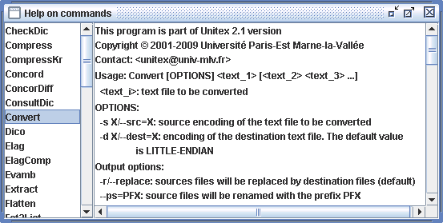
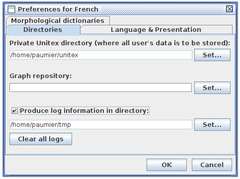
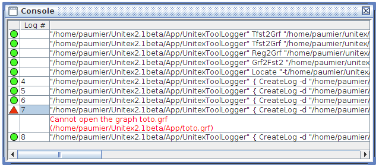

使用外部程序
============

本章介绍了不同程序的使用，其中包括Unitex。这些程序可在\ ``Unitex/App``\ 目录中找到,
由接口自动启动(实际上,
启动\ ``UnitexToolLogger``\ 以显著减少下载的zip文件的大小)。点击
“Info>Console”查看已执行的命令。也可点击 “Info>Help on
commands”查看不同程序的操作
(如图[fig-help])。所有Unitex程序有``-h``/``--help``\ 所示操作。

   Help on commands[fig-help]

注意:
许多程序使用文本目录(\ ``mon_texte_snt``)。此目录在文本正常化之后由图形界面创建。如果你使用命令行，你必须在程序标准化执行之前手动创建该目录。

注意(2): 当一个参数包含空格，它需要在两边加
引号，以防止它被视为多个参数。

注意(3):许多程序使用一个Alphabet.txt文件。对于这些程序，也可省略该步骤。在这种情况下，一个默认字母定义被使用
(见在源文件``Unicode.cpp``\ 中的 ``u_is_letter``)。

创建日志文件
------------

[section-creating-log-files]

   Configuration de fichiers log[fig-logging-config]

您可以创建外部程序启动的\ ``log``\ 文件。这些日志文件可以使用在调试或回归测试过程中。你只需要在偏好设置中启用此功能。你必须选择，所有的日志文件将存储在日志目录，选择“Produce
log”。点击“Clear all logs”按钮将删除这个目录中的所有日志文
件。然后，任何进一步的程序执行将产生位于log目录中的\ ``unitex_log_XXX.ulp``\ 文件。
``XXX``\ 代表在控制台中的日志编号（见 下节）。

控制台
------

[section-console]
当Unitex启动外部程序时，调用命令行被存储在控制台中。查看点击“Info>Console”。当命令没有发出任何错误消息，它显示一个绿色的图标。否则，该显示图标是一个红色三角形，你可以点击查看错误信息，如图[fig-console]所示。当出现错误信息非常快，你无法读取时，这是非常有效的。如果一个命令已被记录，其日志号显示在第二列。请注意，您可以用Ctrl+
C导出控制台显示的所有命令。

   Console[fig-console]

Unitex JNI
----------

[section-unitex-JNI]

您可以使用Unitex和JNI作为以下接口：

::

    import fr.umlv.unitex.jni.UnitexJni;
    import java.io.*;
    import fr.umlv.unitex.*;

这将允许您加载的.bin，.fst2和字母文件，并保留在内存中持续。您使用loadPersistent\*创建的文件名。

::

    String persistentAlphabet = UnitexJni.loadPersistentAlphabet("/.../unitex/French/Alphabet.txt");
    String persistentFst2 = UnitexJni.loadPersistentFst2("/.../unitex/French/Dela/fogg-r.fst2");
    String persistentDictionary = UnitexJni.loadPersistentDictionary(
            "/.../unitex/French/Dela/communesFR+.bin");

文本文件编码设置
----------------

[section-text-file-encoding-parameters]
对于文本文件Unitex使用Unicode[unicode-encoding]。所有的程序，读取或写入文本文件共享相同的编码参数。允许的格式有
utf16le-bom, utf16le-no-bom, utf16be-bom, utf16be-no-bom, utf8-bom,
utf8-no-bom,对应Unicode的Big-Endian,Little-Endian和
UTF-8,有或无在文件的开头“Unicode字节顺序标记”。对于输入格式，您可以指定几个\*-bom编码用逗号隔开，但只有一个\*-no-BOM编码。

**功能:**

-  ``-k=ENCODING``/``--input_encoding=ENCODING``:
   输入文本文件格式。可以包含多个值，用逗号分隔;

-  ``-q=ENCODING``/``--output_encoding=ENCODING``: 输出文本文件格式。

默认值为: ``--input_encoding=utf16le-bom,utf16be-bom,utf8-bom``
``--output_encoding=utf16le-bom``.

构建KrAwu字典
-------------

``BuildKrMwuDic [OPTIONS] dic``

该程序从一个\ ``dic``\ 表产生图表，来描述了每个复合词的每个分量。
**功能:**

-  ``-o GRF``/``--output=GRF``: 产生文件 ``.grf``;

-  ``-d DIR``/``--directory=DIR``:
   包含以产生基层形态学变型所需要的弯曲图形目录;

-  ``-a ALPH``/``--alphabet=ALPH``:使用的字母文件;

-  ``-b BIN``/``--binary=BIN``: 使用简单类型\ ``.bin``\ 的词典;

Cassys
------

``Cassys [OPTIONS] <snt>``

该程序适用一个有序语法列表以一个文本和创建已发现事件的索引。 **功能:**

-  ``-a ALPH``/``--alphabet=ALPH``: 字母文件;

-  ``-r X``/``--transducer_dir=X``: 在目录 ``X``
   采用一个译码器(对于每个译码器不用给完整路径; 注意 ``X``
   必须反斜线结束;

-  ``-w DIC/--morpho=DIC``: 表明\ ``DIC`` 是一个 ``.bin``
   使用形态模式的字典。 也可使用有\ ``.bin``\ 的\ ``-m XXX``
   q\ ``.bin``. 你可以用冒号来分隔许多 ``.bin``\ 。

-  ``-l TRANSDUCERS_LIST``/``--transducers_list=TRANSDUCERS_LIST``:
   含有译码器的列表以及它们的应用方法的文件;

-  ``-s transducer.fst2``/``--transducer_file=transducer.fst2``:
   使用译码器;

-  ``-m output_policy``/``--transducer_policy=output_policy``:
   指定的译码器的应用程序模式;

-  ``-t TXT``/``--text=TXT``:文本文件进行修改，以扩展名``.snt``;

-  ``-i``/``--in_place``: 意味着对每个译码器使用相同的
   ``csc/snt``\ 目录;

-  ``-d``/``--no_create_directory``:
   意味着所有\ ``snt/csc``\ 目录已经存在，并不需要创建;

-  ``-g minus``/``--negation_operator=minus``: 使用减号作为否定运算符 （
   Unitex版本 2.0）;

-  ``-g tilde``/``--negation_operator=tilde``:
   使用波浪号作为否定运算符（默认）;

-  ``-h``/``--help``: 显示帮助

Cassys使用一系列语法于文章，并保存匹配序列索引
于文本目录下一个名为\ ``concord.ind``\ 的文件。目标文本文件必须是一个\ ``\_snt/``\ 文件。译码器列表文件，其中每一行包含路径到一个换能器，随后通过输出政策应用于该译码器的一个文件。

除了一个列表,你还可以指定每个文件和应用程序方法通过一对变量来介绍列表\ ``-s/--transducer\_file``\ 和\ ``-m/--transducer\_policy``
。

应用程序方法可以是合并或替换。

该文件选项，字母选项和译码器列表文件选项是强制性的。

作为定位程序，该程序将事件索引保存在\ ``\_snt/``\ 目录下的\ ``concord.ind``\ 文件，\ ``concord.ind``\ 文件产生的格式与章节[chap-file-formats]的一样，但是级联形式可由合并或替换形式图像组成，这种情况下#M或#R在\ ``concord.ind``\ 文件第一行没有意义。

检查字典
--------

``CheckDic [OPTIONS] dic``

该程序执行DELAS或者DELAF的字典格式的验证。\ ``dic``\ 对应于要被验证的字典的名称。

**功能:**

-  ``-f``/``--delaf``: 检查屈折字典;

-  ``-s``/``--delas``: 检查标准的字典;

-  ``-r``/``--strict``: 严格的语法检查，对未受保护点和逗号检查;

-  ``-t``/``--tolerate``: 允许无保护点和逗号（默认）;

-  ``-n``/``--no_space_warning``:允许语法/语义/屈折码中的空格;

-  ``-p``/``--skip_path``:不显示词典的（对于在多个系统一致的日志文件有用）的完整路径;

-  ``-a ALPH``/``--alphabet=ALPH``:指定使用的字母文件。

程序检查字典的行的语法。它还创建了词尾变化和规范化形式存在的所有字符列表，还创建了语法代码和语法的列表，以及使用的变位代码列表。验证的结果存储在一个称为\ ``CHECK_DIC.TXT``\ 的文件中。

选择
``--strict``\ 选项用于检测词形变化形式的未受保护点的使用，或未受保护的逗号。\ ``--tolerate``\ 运行照常如在Unitex
2.0版本和更低版本和无法检测到。

压缩
----

[section-compress] ``Compress [OPTIONS] dictionary``

**选项:**

-  ``-o BIN``/``--output=BIN``:
   设置输出文件。默认情况下，一个\ ``xxx.dic``
   文件将产生一个\ ``xxx.bin``\ 文件;

-  ``-f``/``--flip``:
   表明词形变化和规范形式应该在压缩字典交换。这个功能被用于构建逆词典所必需的程序\ ``Reconstrucao``;

-  ``-s``/``--semitic``:指示闪语压缩算法应该被使用。
   该选项设置闪语如阿拉伯语显著降低输出字典的大小。

-  ``--v1``: 产生一个老式的\ ``.bin``\ 文件;

-  ``--v2``:
   产生一个新式的.bin文件，具有更小的尺寸而且没有文件大小限制为16
   MB（默认）。

该程序占用一个DELAF字典作为参数，并进行压缩。该
字典\ ``dico.dic``\ 的压缩产生两个文件：

-  ``dico.bin``: 包含字典的变化形式的最小自动化二进制文件;

-  ``dico.inf``:
   包含重建从在控制器中的词尾变化形式的字典行所需的压缩形式文本文件。

有关这些文件格式的更多详细信息，请参见章节[chap-file-formats]。

一致性
------

[section-Concord] ``Concord [OPTIONS] <index>``

此程序采用由\ ``Locate``\ 程序产生的一个协调索引文件，并产生一个索引。它也可以产生一个修改后的文本版本考虑到相关联事件的换能器的输出。下面是参数说明：

**功能:**

-  ``-f FONT``/``--font=FONT``:
   如果输出是一个HTML文件要使用的字体的名称;

-  ``-s N``/``--fontsize=N``:
   输出是一个HTML文件使用的字体大小。如果输出是一个HTML文件的，那么字体参数是必需的;

-  ``--only_ambiguous``:只显示有不明确产出的相同事件，按照文本顺序。

-  ``--only_matches``:
   此选项将迫使左右上下文为空。此外，如果与\ ``-t/--text``\ 使用，索引不会与周围已知序列匹配。

-  ``-l X``/``--left=X``:事件（默认值为0）左侧的字符数。
   在泰语模式，这代表着无音调符号字符数。

-  ``-r X``/``--right=X``:发生事件右侧的字符（泰语模式下非音调符号）的数量（默认值为0）。
   如果发生低于该值时，一行的索引完成到右边。如果发生高于该值（由\ ``right``\ 决定）时，它将被全部保存。

   注意: 对于 ``--left`` 和 ``--right``,
   你可以加入字符\ ``s``\ 在句子\ ``{S}`` 末端的第一个符号。 例如,
   如果你把 ``40s`` 作为左边的值,
   左边的文本字符数将最多40，小于40如果\ ``{S}``\ 字符在之前。

**排序模式:**

-  ``--TO``: 按事件出现在文本的顺序（默认）;

-  ``--LC``: 左侧上下文为主要分类，出现顺序作为第二分类;

-  ``--LR``: 左边上下文, 右边上下文;

-  ``--CL``: 事件出现,左边上下文;

-  ``--CR``: 事件出现, 右边上下文;

-  ``--RL``: 右边上下文, 左边上下文;

-  ``--RC``: 右边上下文, 事件出现。

有关排序模式的详细信息，请参见[section-display-occurrences]。

**输出模式:**

-  ``-H``/``--html``: 生成一个在UTF-8编码下HTML格式的索引 (默认下);

-  ``-t``/``--text``: 生成一个Unicode文本格式的索引;

-  ``-g SCRIPT``/``--glossanet=SCRIPT``:
   为GlossaNet生成一个HTML格式的索引。 HTML文件是UTF-8编码;

-  ``-p SCRIPT``/``--script=SCRIPT``:
   生成一个HTML格式的索引，连接由\ ``SCRIPT``\ 写的事件。例如，如果你使用\ ``-phttp://www.google.com/search?q=``,
   您将得到一个HTML格式的索引，事件连接的是访问Google的地址;

-  ``-i``/``--index``: 产生一个一致性的索引, 他包括事件(跟随语法的输出,
   如果有的话), 在文本文件事件位置之前, 由字符表示;

-  ``-u`` ``offsets``/``--uima=offsets``:
   产生一个一致性相关原文本文件的索引， 在Unitex的所有操作实施前。
   Offsets 是由Tokenize在\ ``--output_offsets``\ 操作下生成的文件

-  ``-e``/``--xml``: 生成一个一致性的xml索引;

-  ``-w``/``--xml-with-header``: 生成一个一致性的xml索引和头文件;

-  ``--lemmatize``:
   生成一个HTML索引文件专门用于Unitex图形接口的lemmatisation接口。

   注意: 命令操作-e 和 -w 接受offset的两种文件, 与-u情况相同

-  ``--PRLG=X,Y``:产生一个文库PRLG的索引，每行用Unxmlize的``--PRLG``\ 进行信息提取前缀。
   X 是
   Unxmlize的\ ``--PRLG操作产生的文件， Y是 Tokenize的 \verb``–output\_offsets+
   操作产生的文件。注意如果该操作与\ ``-u``\ 一起使用，Y的参数覆盖X的参数；

-  ``-A``/``--axis``:与 ``--index``\ 十分相似,
   但是数量代表了每个事件的中位字符。更多详细信息，见
   :raw-latex:`\cite{axis}`;

-  ``-x``/``--xalign``: 另一个索引文件，被文本排列模块所使用。 每
   一行是由3个整数\ :math:`X` :math:`Y`
   :math:`Z`\ 组成，之后的事件的内容。\ :math:`X`
   是句子号码，从1开始。\ :math:`Y`\ 和\ :math:`Z`\ 是在字符句子中一个事件开始和结束位置;

-  ``-m TXT``/``--merge=TXT``:
   表明程序应该产生一个修改版本的文本，并将其保存在名为\ ``TXT``\ 的文件（见
   [section-modifying-text]）。

-  | ``T--export_csv``:
     产生具有制表分隔符的文件export.csv，文本顺序如下格式: A B C D E F,
     其中: A=文件的行数 .csv B=句子的数量 C= PRLG 附注,如果存在
     D=存在于文本的变位 E原型,如果存在 F=代码,如果有
   | 运行需要再次调用文件 concord.ind, 该文件既没有标记S也不包括空格

**其他功能:**

-  ``-d DIR``/``--directory=DIR``:指示程序它不能正常工作程序
   在同一个目录\ ``<index>``\ 但在\ ``DIR``\ 可行;

-  ``-a ALPH``/``--alphabet=ALPH``: 用于分类排序的字母文件;

-  ``-T``/``--thai``: 用于泰文词汇索引的选项。

如果词汇配合是文本模式创建的，该程序的应用的结果是一个名为\ ``concord.txt``\ 的文件，如果该程序建立可编辑的文本，那么是一个文件
``concord.html``\ 用于模式\ ``--html``, ``--glossanet``
和\ ``--script``\ ，和另一个由用户定义的文本文件。

在 ``--html``\ 模式下,
事件被编码一个超文链接。该链接的附注是\ ``<a href="X Y Z">``\ 形式的。在文件\ ``text_name.snt``\ 中，\ ``X``
和 ``Y`` 代表了字符事件的开端和结束。\ ``Z``\ 代表了出现事件的句子号码。

ConcorDiff
----------

``ConcorDiff [OPTIONS] <concor1> <concor2>``

该程序需要两个文件的一致性，并产生一个HTML页面，显示
他们的区别（见[section-comparing-concordances]，页）。
一致性文件\ ``<concor1>``\ 和\ ``<concor2>``\ 必须有绝对的文件名，因为Unitex使用这些名称推断哪个已经过计算。

**功能选项:**

-  ``-o X``/``--out=X``: 输出HTML页面;

-  ``-f FONT``/``--font=FONT``:在输出HTML页面中使用的字体;

-  ``-s N``/``--size=N``:在输出HTML页面中使用的字体大小;

-  ``-d/--diff_only``: 不显示相同的序列;

转换
----

``Convert [OPTIONS] <text_1> [<text_2> <text_3> ...]``

该程序用于转码文本文件。

**功能选项:**

-  ``-s X``/``--src=X``: 输入编码;

-  ``-d X``/``--dest=X``: 输出编码 (默认=``LITTLE-ENDIAN``);

**音译选项（仅适用于阿拉伯语）:**

-  ``-F``/``--delaf``:输入是DELAF，我们只直译词尾变位形式和原型;

-  ``-S``/``--delas``: 输入是DELAS，我们只直译原型。

**输出功能:**

-  ``-r``/``--replace``: 输入文件将被覆盖（默认）;

-  ``-o file``/``--output=file``: 目标文件名（只有一个文件进行转换）;

-  ``--ps=PFX``:输入文件用``PFX``\ 前缀重命名(\ ``toto.txt``
   :math:`\Rightarrow` ``PFXtoto.txt``);

-  ``--pd=PFX``:目标文件用``PFX``\ 前缀重命名;

-  ``--ss=SFX``: 输入文件用\ ``SFX``\ 后缀重命名； (``toto.txt``
   :math:`\Rightarrow` ``totoSFX.txt``);

-  ``--sd=SFX``: 目标文件用\ ``SFX``\ 后缀重命名。

**功能 HTML:**

``Convert``\ 提供用于HTML文件的一些特殊的功能。您可以使用以下功能的组合：:

-  ``--dnc`` (Decode Normal Chars):字符串像\ ``&eacute;`` ``&#120;`` 和
   ``&#xF8;``\ 将被解码为单个等效Unicode字符，除非它表示
   一个HTML控制字符;

-  ``--dcc`` (Decode Control Chars): ``&lt;`` ``&gt;`` ``&amp;`` 和
   ``&quot;``\ 将被解码为\ ``<``\ ``>``\ ``&``\ 和引号（同为十进制和十六进制表示）;

-  ``--eac`` (Encode All Chars):未由输出编码支持的每个字符将被编码为像
   ``&#457;``\ 的字符串

-  ``--ecc`` (Encode Control Chars): ``<`` ``>`` ``&``\ 和引号被
   ``&lt;`` ``&gt;`` ``&amp;`` 和\ ``&quot;``\ 编码。

所有的HTML选项默认设置为停用。

**其他功能:**

-  ``-m``/``--main-names``: 打印编码主要名称的列表;

-  ``-a``/``--aliases``: 打印编码别名列表;

-  ``-A``/``--all-infos``: 打印所有的编码相关信息;

-  ``-i X``/``--info=X``: 打印所有关于编码X上的信息。

该编码可以采取以下列表的值（非详尽，见下文）Les encodages prennent leurs
valeurs dans la liste suivante (liste non exhaustive, voir ci-dessous):

``FRENCH``

``ENGLISH``

``GREEK``

``THAI``

``CZECH``

``GERMAN``

``SPANISH``

``PORTUGUESE``

``ITALIAN``

``NORWEGIAN``

``LATIN`` (default latin code page)

``windows-1252``: Microsoft Windows 1252 - Latin I (Western Europe &
USA)

``windows-1250``: Microsoft Windows 1250 - Central Europe

``windows-1257``: Microsoft Windows 1257 - Baltic

``windows-1251``: Microsoft Windows 1251 - Cyrillic

``windows-1254``: Microsoft Windows 1254 - Turkish

``windows-1258``: Microsoft Windows 1258 - Viet Nam

``iso-8859-1  ``: ISO 8859-1 - Latin 1 (Europe de l’ouest & USA)

``iso-8859-15 ``: ISO 8859-15 - Latin 9 (Western Europe & USA)

``iso-8859-2  ``: ISO 8859-2 - Latin 2 (Eastern and Central Europe)

``iso-8859-3  ``: ISO 8859-3 - Latin 3 (Southern Europe)

``iso-8859-4  ``: ISO 8859-4 - Latin 4 (Northern Europe)

``iso-8859-5  ``: ISO 8859-5 - Cyrillic

``iso-8859-7  ``: ISO 8859-7 - Greek

``iso-8859-9  ``: ISO 8859-9 - Latin 5 (Turkish)

``iso-8859-10 ``: ISO 8859-10 - Latin 6 (Nordic)

``next-step   ``: NextStep code page

``LITTLE-ENDIAN``

``BIG-ENDIAN``

``UTF8``

Dico
----

``Dico [OPTIONS] <dic_1> [<dic_2> <dic_3>...]``

该程序将应用字典于一个文本。\ ``Tokenize``\ 程序必须将文本分割成词汇单元。

**功能:**

-  ``-t TXT``/``--text=TXT``:``.snt``\ 文本文件的完整名称；

-  ``-a ALPH``/``--alphabet=ALPH``: 使用的字母文件;

-  ``-m DICS``/``--morpho=DICS``:该选项参数指示哪些形态学模式字典是要使用的，如果需要的话通过一些``.fst2``\ 字典。
   ``DICS``\ 代表用分号分隔的\ ``.bin``\ 文件（全路径）的列表;

-  ``-K``/``--korean``: 指示 ``Dico``\ 适用于韩语;

-  ``-s``/``--semitic``:指示``Dico``\ ，在闪族语环境下运行（在\ ``Dico``\ 需要压缩字典的情况下需要）;

-  ``-u X``/``--arabic_rules=X``:规定了阿拉伯语排版规则配置文件。

-  ``r X``/``--raw=X``:
   表明\ ``Dico``\ 应只生产一个含有简单和复合词输出文件X，而不需要一个文本目录。如果X被忽略了，结果显示在标准输出。

``<dic_i>``\ 表示字典的路径和名称。这本字典必须是.\ ``.bin``\ 压缩格式（由\ ``Compress``\ 程序获得），或\ ``.fst2``\ 格式的图像字典（见章节[section-applying-dictionaries]，页）。
可以给该字典优先权。详细内容请参见[section-dictionary-priorities]。

程序\ ``Dico``\ 生成以下文件，并在文本目录保存它们：

-  ``dlf``: 文本中简单词汇的字典;

-  ``dlc``: 文本中复合词汇的字典;

-  ``err``: 文本中未知词汇的列表;

-  ``tags_err``:未被文件``tags.ind``\ 识别的简单未知词汇;

-  ``tags.ind`` : 插入序列于自动机 (见章节 [section-dictionary-graphs],
   页数 );

-  ``stat_dic.n``:包含文本中简单，复合词和未知词汇数量的文件。

注：文件\ ``dlf``, ``dlc``, ``err`` 和
``tags_err``\ 不排序。使用程序\ ``SortTxt``\ 对它们进行排序。

转储偏移
--------

[section-DumpOffsets] **用法:** ``DumpOffsets [OPTIONS] <txt>``

``<txt>: fichier d'offsets d'origine``

该程序允许学习和使用偏移量对应的文件，由一些Unitex工具操控，如Unxmlize,
Normalize, Fst2Txt, Tokenize, Concord 和 GrfTest。

**功能:**

-  ``-o X``/``--old=X``: 旧文件名称

-  ``-n X``/``--new=X``: 新文件名称

-  ``-p X``/``--output=X``: 输出文件的名称

-  ``-f``/``--full``: 加入常用的文本

-  ``-q``/``--quiet``:不显示消息

-  ``-c``/``--no_escape_sequence``: 不要忽略文本序列

-  ``-h``/``--help``: 帮助

例子:

::

         UnitexToolLogger Normalize -r .\resource\Norm.txt .\work\text_file.txt      
                 --output_offsets .\work\text_file_offset.txt    
         UnitexToolLogger DumpOffsets -o .\work\text_file_offset.txt -n .\work\text_file_offset.snt      
                -p .\work\dump\dump_offsets.txt .\work\text_file_offset.txt      

**其他用途:** ``DumpOffsets [-m/--merge] [OPTIONS] <txt>``

``<txt>: fichier d'offsets d'origine``

通过两个连续的文本修改而产生的两个偏移文件合并。

**功能:**

-  ``-o X``/``--old=X``: 旧文件名称

-  ``-n X``/``--output=X``: 合并偏移文件名称

**其他用途:**
``DumpOffsets [-v/--convert_modified_to_common] [OPTIONS] <txt>``

``<txt>: fichier d'offsets d'origine``

创建偏移文件，该文件列出原始的和修改过的文件之间的共同字符串的偏移量。必须提供至少一个尺寸。

**功能:**

-  ``-s N``/``--old_size=N``: 原始文件的大小（以字符计算）

-  ``-S N``/``--new_size=N``: 修改后的文件大小（以字符计算）

-  ``-p X``/``--output=X``: 常用偏移文件的名称

-  ``-h``/``--help``: 帮助

**其他用途:**
``DumpOffsets [-M/--convert_modified_to_common] [OPTIONS] <txt>``

``<txt>: fichier d'offsets d'origine``

从原来的和修改过的文件之间的共同字符串的偏移量创建一个标准的偏移编辑文件。必须提供两种大小。

**功能:**

-  ``-s N``/``--old_size=N``: 原始文件的大小（以字符计算）

-  ``-S N``/``--new_size=N``: 修改后的文件大小（以字符计算）

-  ``-p X``/``--output=X``: 常用偏移文件的名称 d’offsets courant

-  ``-h``/``--help``: 帮助

**其他用途:** ``DumpOffsets -o <list_of_position_file_to_read.txt>``

``<list_of_position_file_to_read.txt>``\ 是在每行只有一个号码（一个位置）的文本文件。
这里使用偏移文件转换一个位置列表。如果在这个位置上的字符在新文件中，所创建的文件每一行中包含后接一个+的新位置，如果该字符被删除，后接
-。

-  ``-p <list_to_create> -T <offset_file_to_read>``

使用 ``-t`` 代替 ``-T``\ 会做反向翻译。

转储偏移
--------

[section-DumpOffsets]

该程序允许学习和使用偏移量对应的文件，由一些Unitex工具操控，如Unxmlize,
Normalize, Fst2Txt, Tokenize, Concord 和 GrfTest。

::

    DumpOffsets --merge -o <fichier_offsets1> <fichier_offsets2>
      -p <fichier_offset12>

起始, 文件offsets1 (章节[subsection-offsets-diff], 页数
))包含A，B版本文件之间的对应偏移，文件offset2包含B，C版本文件直接的对应偏移,
文件fichier\_offset12最终结果将是A，B版本文件之间。

::

    DumpOffsets [OPTIONS] -o <fichier_version1> -n <fichier_Version2>
      <fichier_offset> -p <fichier_dump>

**功能:**

-  ``-f/--full``: 包括更完整的信息

起始,
文件fichier\_offset包含了fichier\_version1和fichier\_version2之间的对应偏移。结尾，文本文件<fichier\_dump>包含两个文件的序列比较并检查它们的一致性。此文件是阅读手册，以便于学习偏移文件的内容

::

    DumpOffsets [OPTIONS] --convert_modified_to_common 
      <fichier_offset_différence> -p <fichier_offset_zone_commune>

**功能:**

-  ``-s N/--old_size=N``: 原始文件的大小（以字符计算）

-  ``-S N/--new_size=N``: 修改后的文件大小（以字符计算）

必须指定两种尺寸之一。UTF16BE\_BOM编码格式的文件,尺寸为字节，我们先减去BOM签名的两个字节，然后除以2因为每个字符占两个字节。
在UTF8格式,一致性不是立即的。

将指示删除的字符的偏移文件（由Unitex其他工具提供）转换为，指示相同字符的地方。
([subsection-offsets-common]).

::

    DumpOffsets [OPTIONS] --convert_common_to_modified
      <fichier_offset_zone_commune> -p <fichier_offset_différence>

**功能:**

-  ``-s N/--old\_size=N``: 原始文件的大小（以字符计算）

-  ``-S N/--new\_size=N``: 修改后的文件大小（以字符计算

必须指定两种尺寸。

将指示相同字符的地方的偏移文件转换为指示删除字符的文件。

Elag
----

``Elag [OPTIONS] <tfst>``

该程序需要使用\ ``.tfst``\ 文本自动\ ``<tfst>``\ ，并让其适用于歧义去除规则。

**功能:**

-  ``-l LANG/--language=LANG``: 文本语言配置文件ELAG

-  ``-r RULES/--rules=RULES``: ``.rul``\ 格式的规则文件;

-  ``-o OUT/--output=OUT``: 输出文本自动机。

ElagComp
--------

``ElagComp [OPTIONS]``

该程序编译名为\ ``GRAMMAR``\ 的语法ELAG，或在\ ``RULES``\ 文件中指定的所有语法。其结果存储在将由\ ``Elag``\ 程序使用的\ ``OUT``\ 文件。
**功能:**

-  ``-r RULES``/``--rules=RULES``: 列出ELAG语法的文件;

-  ``-g GRAMMAR``/``--grammar=GRAMMAR``: 一个给出的ELAG语法;

-  ``-l LANG``/``--language=LANG``: 对相关语言的ELAG 配置文件;

-  ``-o OUT``/``--output=OUT``:
   输出文件。默认情况下，输出文件都遵循\ ``RULES``\ ，除了扩展名\ ``.rul``\ 。

Evamb
-----

``Evamb [OPTIONS] <tfst>``

该程序对所有的文本自动计算\ ``<tfst>``\ ，或者只是\ ``N``\ 指定的句子计算平均歧义率。计算的结果显示在标准输出。文本自动机不被该程序修改。

**功能:**

-  ``-o OUT``/``--output=OUT``: 可选文件名;

-  ``-s N``/``--sentence=N``: 句子编号。

提取
----

``Extract [OPTIONS] <text>``

该程序从文本提取所有至少含有一个一致性事件的句子。参数\ ``<text>``\ 代表了文本文件的完整路径，不省略扩展名\ ``.snt``\ 。

**功能:**

-  ``-y``/``--yes``: 提取包含匹配单元所有句子(默认);

-  ``-n``/``--no``: 提取不包含匹配单位所有句子;

-  ``-o OUT``/``--output=OUT``: 输出文本文件;

-  ``-i X``/``--index=X``:
   描写一致性文件\ ``.ind``\ 。默认条件下，\ ``X``\ 是位于文本目录下的\ ``concord.ind``\ 文件。

结果是包含所有提取的句子，每行一个句子的文本文件。

展平
----

``Flatten [OPTIONS] <fst2>``

该程序需要\ ``.fst2``\ 语法作为它的参数，并试图将其改造成一个有限状态传感器。

**功能:**

-  ``-f``/``--fst``:语法是“展开”，以最大程度，而且截断如果子图调用存在。截断调用由空转变所取代。其结果是一个仅含有一个单一的有限状态换能器\ ``.fst2``\ 语法;

-  ``-r``/``--rtn``:变换留下之后子图调用也继续存在。在有利的情况下，结果是有限状态换能器，相反情况下优化的语法严格等同于原始语法（默认）;

-  ``-d N``/``--depth=N``:最大深度决定了哪个图调用将被打开。默认值为10.

Fst2Check
---------

``Fst2Check [OPTIONS] <fst2>``

该程序检查文件.fst2是否无本地错误。 **功能:**

-  ``-y``/``--loop_check``:运行错误错误校验（循环检测）;

-  ``-n``/``--no_loop_check``: 禁用错误检查（默认）;

-  ``-t``/``--tfst_check``:检查给定的图是否可以被视为有效的句子自动机;

-  ``-e``/``--no_empty_graph_warning``: 当图识别空词时不出现警告。
   该功能由
   ``MultiFlex``\ 使用，为了用户不被毫无意义的错误消息吓到，当他们创建了识别空词的词形变化语法。

**输出功能:**

-  ``-o file``/``--output=file``: 错误信息输出文件;

-  ``-a``/``--append``: 追加模式下打开一个错误信息文件;

-  ``-s``/``--statistics``: 显示文件\ ``.fst2``\ 统计信息。

Fst2List
--------

``Fst2List [-o out][-p s/f/d][-[a/t] s/m][-m][-f s/a][-s[0s] "Str"]``

``         [-r[s/l] "Str"] [-l line#] [-i subname]*``

``         [-c SS=0xxxx]* fname``

该程序需要一个\ ``.fst2``\ 文件，并列出了这个语法识别的序列。参数如下：

-  ``fname`` :语法名称, 伴随扩展名 ``.fst2``;

-  ``-o out`` : 指定输出文件。 默认情况下，该文件名为 ``lst.txt``;

-  ``-S`` : 在标准输出上的显示效果。专用 ``-o``;

-  ``-[a/t] s/m`` : 如果程序必须考虑到(\ ``t``)
   或不(\ ``a``)（一）在任何语法的输出。
   ``s``\ 表示只存在一个初始状态，而\ ``m``\ 表示有几个（该模式对韩语有效）。默认情况，参数\ ``-a s``;

-  ``-l line#`` : 在输出文件被打印行的最大数量;

-  ``-i subname`` :
   表示当程序识别图形\ ``subname``\ 必须停止进入递归检查。这个参数可多次用于以指定多个停止图表;

-  ``-p s/f/d`` : ``s`` 显示语法的路径图; ``f`` （默认）显示全球的路径;
   ``d``\ 可以显示全球的路径和嵌套图形调用的信息；

-  ``-c SS=0xXXXX``:
   替换\ ``SS``\ ，当它出现在十六进制\ ``0xXXXX``\ 尖括号之间；

-  ``-s "L[,R]"`` :
   指定包围项目的左(\ ``L``)和右(\ ``R``)分隔符。默认情况下，没有分隔符;

-  ``-s0 "Str"``
   :如果程序必须把输出考虑在内，此参数指定将输入和输出之间插入序列``Str``\ 。默认情况下，没有分隔;

-  ``-f a/s`` : 如果程序必须把输出考虑在内,
   此参数规定了将要生成的行的格式 : ``in0 in1 out0 out1`` (``s``) ou
   ``in0 out0 in1 out1`` (``a``)。默认值为 ``s``;

-  ``-ss "stop"``: 定义 “str” 为搜索停止的标志。 默认值为 ``null``;

-  ``-v`` : 显示过程中的信息; (详细模式);

-  ``-m`` : 字母描述特殊模式;

-  ``-rx "L,[R]"``: 该参数指定了周期该如何说明设计分隔符的\ ``L`` 和
   ``R``\ 。我们可以考虑下图 [cycle], 下面是我们得出的结果
   ``L``\ =“``[``” 和 ``R``\ =“``]*``”:

   ``il fait [très très]*``

   ``il fait très beau``

   .. figure:: resources/img/fig10-1.png
      :alt: Graphe avec un cycle[cycle]
      :width: 7.00000cm

      Graphe avec un cycle[cycle]

Fst2Txt
-------

[section-Fst2Txt] ``Fst2Txt [OPTIONS] <fst2>``

本程序将应用传感器在预处理阶段中最长的匹配模式于文本，当文本还没有被切割成词汇单位。
**功能:**

-  ``-t TXT``/``--text=TXT``: 可修改的文本文件，以扩展名.snt;

-  ``-a ALPH``/``--alphabet=ALPH``: 文本语言的字母文件;

-  ``-s``/``--start_on_space``:该参数表示搜索将在文本中的任何位置开始，即使是空格前。该参数应仅用来进行形态学的搜索;

-  ``-x``/``--dont_start_on_space``:禁止程序识别从空格开始的序列(默认);

-  ``-c``/``--char_by_char``:
   对逐个字符使用字符标记化模式。对于像泰语非常适用;

-  ``-w``/``--word_by_word``:逐个词语运行 (默认);

-  ``--input_offsets=XXX``: 使用的偏移文件。

**输出功能:**

-  ``-M``/``--merge``: 合并文本输入和传感器输出 (默认);

-  ``-R``/``--replace``: 用相应的传感器输出代替文本输入。

-  ``--output_offsets=XXX``: 生成的偏移文件

该程序用于修改输入文本文件。

Grf2Fst2
--------

``Grf2Fst2 [OPTIONS] <grf>``

该程序将语法编译成\ ``.fst2``\ 文件（详见章节
[section-graph-compilation]）。参数``<grf>``\ 表示语法的主要图形的完整路径，不省略扩展名\ ``.grf``\ 。

**功能:**

-  ``-y``/``--loop_check``: 启用错误检查（循环检测）;

-  ``-n``/``--no_loop_check``: 禁用错误检查（默认）;

-  ``-a ALPH``/``--alphabet=ALPH``:
   指定用于在语法箱子划分词汇单元的字母文件。

-  ``-c``/``--char_by_char``: 划分由逐个字符完成。如果没有使用\ ``-c``
   也没有使用 ``-a``\ 时，词汇单位将是任意Unicode字母排列的。

-  ``-d DIR``/``--pkgdir=DIR``: 指定编译语法的库目录 (见章节
   [section-repository], 页码 )。

-  ``-e``/``--no_empty_graph_warning``: 当图像匹配空词时不发出警告。
   该功能由\ ``MultiFlex``\ 使用，为了当用户创建了识别空词的词形变化语法，不被毫无意义的错误消息吓到。

-  ``-t``/``--tfst_check``: 检查给出的图形是否是有效的句子自动器;

-  ``-s``/``--silent_grf_name``: 不显示图形名称
   (日志文件需多系统兼容使用);

-  ``-r XXX``/``--named_repositories=XXX``:声明库的目录名。 XXX
   由一个或多个X=Y序列组成，用‘;’分开,X是由路径Y设定的库目录名称。该功能可多次使用;

-  ``--debug``: 调试模式下编译图形;

-  ``-v``/``check_variables``:检查输出有效性以避免格式错误变量表达式。

结果是与作为传递给该程序作为参数的图形具有相同名称的文件，扩展名\ ``.fst2``\ 。该文件保存在同一目录\ ``<grf>``\ 。

GrfDiff
-------

``GrfDiff <grf1> <grf2>: fichier fichiers .grf`` à comparer

**功能:**

-  ``--output X``: 保存结果于X而不显示

比较给定的.grf文件并显示他们在标准输出上的差异。如果它们有相同的模再排序框和转换，返回0，如果有差异返回1，错误的情况下返回2。

这里是GrfDiff可以发出的指示：

-  ``P name``: 介绍属性已更改。名称=属性名（大小， 字体，...）

-  ``M a b``: 盒子移动。a= <grf1>中盒子编号, b=<grf2>中盒子编号

-  ``C a b``: 盒子内容已变。 a=<grf1>中盒子编号, b=<grf2>中盒子编号

-  ``A x``: 已添加一个盒子。 x=<grf2>中盒子编号

-  ``R x``: 已删除一个盒子。 x=<grf1>中盒子编号

-  ``T a b x y``: 一个转变已被添加。 a,b=<grf1>中盒子src和dst编号。 x,y=
   <grf2>中盒子src和dst编号

-  ``X a b x y``: 一个转变已被删除。 a,b=<grf1>中盒子src和dst编号。
   x,y=<grf2>中盒子src和dst编号。

请注意有关已添加或移除框的转变修改不被报告。

GrfDiff3
--------

GrfDiff3 <mine> <base> <other>

<mine>: 我的文件 .grf <other>: 产生冲突的其他文件 .grf <base>:
共同的原始文件 .grf

**功能:**

-  ``--output`` ``X``: 保存结果于X，而不是在输出

-  ``--conflicts`` ``X``: 保存冲突的描述，如果有保存于X

-  ``--only-cosmetic``: 标明所有变化的冲突，不单单是表面的。

尝试合并<mine>
和<other>。在成功的情况下，结果被打印在标准输出并返回0。在冲突未解决的情况下，则返回1，并不打印任何内容。
在出错的情况下返回2。

ImplodeTfst
-----------

``ImplodeTfst [OPTIONS] <tfst>``

该程序内爆特定的文本自动机，通过合并只有屈折特征不同的词目。 **功能:**

-  ``-o OUT``/``--output=OUT``: 输出文件。默认情况，修改文本自动机 。

定位
----

[section-Locate] ``Locate [OPTIONS] <fst2>``

该程序使用语法于文本并构造发现事件的索引文件。

**功能:**

-  ``-t TXT``/``--text=TXT``:
   文本文件的完整路径，不省略扩展名\ ``.snt``;

-  ``-a ALPH``/``--alphabet=ALPH``:字母文件的完整路径;

-  ``-m DICS``/``--morpho=DICS``:
   此可选参数指示哪些形态学模式字典是要使用的，需要\ ``.fst2``\ 字典。
   ``DICS``\ 代表用分号分隔的\ ``.bin`` 文件列表（全路径）;

-  ``-s``/``--start_on_space``:
   该参数表示搜索将从文本中的任何位置开始，即使是空格之前。该参数应仅用来进行形态学的搜索;

-  ``-x``/``--dont_start_on_space``:禁止程序识别从空格开始的序列 (默认);

-  ``-c``/``--char_by_char``:
   此可选参数对逐个字符使用换能器在字符模式。该功能适用于亚洲语言例如泰语;

-  ``-w``/``--word_by_word``: 逐词模式运行 (默认);

-  ``-d DIR``/``--sntdir=DIR``:将成品文件置于``DIR``\ 目录而不是文本目录。注意\ ``DIR``\ 必须由分隔文件结束
   (``\`` 或者 ``/``);

-  ``-K``/``--korean``: 表示\ ``Locate``\ 运行于韩语;

-  ``-u X``/``--arabic_rules=X``: 阿拉伯语排版规则配置文件;

-  ``-g X``/``--negation_operator=X``:
   指定否定运算符在词汇掩模的使用。\ ``X``\ 的两个可能的值为\ ``moins``
   和\ ``tilde``\ （默认）。 使用\ ``moins``\ 使Unitex与原先版本兼容。

**搜索限制功能:**

-  ``-l``/``--all``: 查找所有匹配 (默认);

-  ``-n N``/``--number_of_matches=N``: ``N`` 匹配之后停止。

**每个标记最大迭代次数功能:**

-  ``-o N``/``--stop_token_count=N``: 在一个标记上N次迭代后停止;

-  ``-o N,M``/``--stop_token_count=N,M``:
   发出在一个标记N次迭代后的警告,M迭代后停止警告。

**匹配模式功能:**

-  ``-S``/``--shortest_matches``;

-  ``-L``/``--longest_matches`` (默认);

-  ``-A``/``--all_matches``.

**输出功能:**

-  ``-I``/``--ignore``: 忽略传感器输出（默认）;

-  ``-M``/``--merge``: 合并文本输入和传感器输出;

-  ``-R``/``--replace``: 用相应的传感器输出替换文本输入;;

-  ``-p``/``--protect_dic_chars``: 当使用\ ``-M`` 和 ``-R``\ 模式时,
   ``-p`` 用反斜杠保护一些输入的字符。 当\ ``Dico``
   调用\ ``Locate``\ 时该功能被激活， 以防止不好结果的行，例如:

   ``3,14,.PI.NUM``

-  ``-v X=Y``/``--variable=X=Y``:定义一个输出变量``X``
   和一个内容物\ ``Y``\ 。 注意 Y必须是ASCII码。

**歧义的输出功能:**

-  ``-b``/``--ambiguous_outputs``:
   允许匹配最终成品具有相同的输入，但不同的输出（默认）;

-  ``-z``/``--no_ambiguous_outputs``:
   禁止歧义的输出。在不明确输出的情况下，一个将被任意选择并保持，根据程序的内部状态。

**变量错误功能**

如果输出模式设置\ ``--ignore``\ ，该功能无效; 反之,
当输出包含对不正确定义变量的引用时，它们定义了\ ``Locate``\ 程序的行动。

-  ``-X``/``--exit_on_variable_error``: 中断程序;

-  ``-Y``/``--ignore_variable_errors``: 如果变量内容为空则运行(默认);

-  ``-Z``/``--backtrack_on_variable_errors``: 中断对语法路径的搜索。

**变量注入:**

-  ``-v X=Y``/``--variable=X=Y``:定义一个输出变量``X``
   和一个内容物\ ``Y``\ 。 注意Y 必须是ASCII码。

该程序保存一个叫\ ``concord.ind``\ 文件中发现的事件引用。 事件的数量，
属于这些事件的单元数量，以及文本中匹配单元百分比都保存在一个叫\ ``concord.n``\ 的文件里。这两个文件都保存在文本目录下。

定位Tfst
--------

[section-LocateTfst] ``LocateTfst [OPTIONS] <fst2>``

该程序使用语法于一个文本自动机，并保存匹配序列的索引于一个名为\ ``concord.ind``\ 的文件中，如同\ ``Locate``\ 的功能。

**功能:**

-  ``-t TFST``/``--text=TFST``: 文本文件的完整路径，不省略扩展名;

-  ``-a ALPH``/``--alphabet=ALPH``: 字母文件的完整路径;

-  ``-K``/``--korean``:指示 ``LocateTfst`` 在韩语环境下运行;

-  ``-g X``/``--negation_operator=X``:
   指定否定运算符在词汇掩模的使用。\ ``X``\ 的两个可能的值为\ ``moins``
   和\ ``tilde``\ （默认）。 使用\ ``moins``\ 使Unitex与原先版本兼容。

**搜索限制功能:**

-  ``-l``/``--all``: 查找所有匹配（默认）;

-  ``-n N``/``--number_of_matches=N``: 第一次\ ``N`` 匹配之后停止.

**匹配模式功能:**

-  ``-S``/``--shortest_matches``;

-  ``-L``/``--longest_matches`` (默认);

-  ``-A``/``--all_matches``.

**输出功能:**

-  ``-I``/``--ignore``: 忽略传感器输出（默认）;

-  ``-M``/``--merge``:合并文本输入和传感器输出;

-  ``-R``/``--replace``: 用相应的传感器输出替换文本输入;

**歧义的输出功能:**

-  ``-b``/``--ambiguous_outputs``:
   允许匹配最终成品具有相同的输入，但不同的输出（默认）;

-  ``-z``/``--no_ambiguous_outputs``:
   禁止歧义的输出。在不明确输出的情况下，一个将被任意选择并保持，根据程序的内部状态。

**变量错误功能**

如果输出模式设置\ ``--ignore``\ ，该功能无效; 反之,
当输出包含对不正确定义变量的引用时，它们定义了\ ``Locate``\ 程序的行动。

-  ``-X``/``--exit_on_variable_error``: 中断程序;

-  ``-Y``/``--ignore_variable_errors``: 如果变量内容为空则运行(默认);

-  ``-Z``/``--backtrack_on_variable_errors``:中断对语法路径的搜索。

**变量注入**

-  ``-v X=Y``/``--variable=X=Y``: 定义一个输出变量\ ``X``
   和一个内容物\ ``Y``\ 。 注意Y必须是ASCII码。

**标签功能**

-  ``--tagging``:
   指示一致性必须是标记之一，包含在每个匹配的开始和结束状态的其他信息。

该程序保存一个叫\ ``concord.ind``\ 文件中发现的事件引用。 事件的数量，
和输出成品的数量都保存在一个叫\ ``concord_tfst.n``\ 的文件里。这两个文件都保存在文本目录下。

MultiFlex
---------

``MultiFlex [OPTIONS] <dela>``

该程序执行DELA字典的词形变化自动，字典包括简单词原型(参见章节[section-DELAS-format])和复合词(参见章节[chap-multiflex])原型。

**功能:**

-  ``-o DELAF``/``--output=DELAF``: 输出DELAF文件;

-  ``-a ALPH``/``--alphabet=ALPH``: 字母文件;

-  ``-d DIR``/``--directory=DIR``: 包含文件\ ``Morphology``\ 和
   ``Equivalences``\ 以及简单，复合词词形变化图像的目录;

-  ``-K``/``--korean``: 指示 ``MultiFlex`` 在韩文的环境下运行;

-  ``-s``/``--only-simple-words``:程序会把复合词看作错误;

-  ``-c``/``--only-compound-words``: 程序会把简单词看作错误;

-  ``-p DIR``/``--pkgdir=DIR``: 指示图形目录。

-  ``-rXXX``/``--named_repositories=XXX``:
   声明库的目录名。XXX由一个或多个X=Y序列组成，用;分开,X是由路径Y设定的库目录名称。该功能可多次使用;

需要注意的是词形变化传感器\ ``.fst2``\ 会自动从\ ``.grf``\ 相应文件构建，在缺失情况或者比\ ``.grf``\ 文件旧的情况下。

规范化
------

[section-Normalize] ``Normalize [OPTIONS] <text>``

该程序进行文本分隔符的规范化。分离器可以是空格，制表符和换行符。分隔符每一个序列包含至少一个换行符，由唯一的换行符替换。分离器的所有其他序列由一个空格替换。

该程序还检查文本中发现的词汇标签的句法。在大括号里的所有序列应该是句子分隔符\ ``{S}``\ ，停止标记\ ``{STOP}``\ ，或者DELAF格式的有效条目（\ ``{aujourd'hui,.ADV}``\ ）。

参数\ ``<text>``\ 表示文本文件的完整路径。该程序创建
一个修改版本的文本，保存在扩展名为\ ``.snt``\ 的文件中。

**功能:**

-  ``-n``/``--no_carriage_return``:
   每一个分离器序列将变成一个单一的空格;

-  ``--input_offsets=XXX``: 使用的偏移文件。

-  ``--output_offsets=XXX``: 产生的偏移文件。

-  ``-r XXX``/``--replacement_rules=XXX``:
   指定要使用的规范化规则文件。请参阅有关此文件格式的详细信息[section-normalization-file]。默认情况下，该程序只用\ ``[``
   和\ ``]``\ 替换\ ``{`` 和\ ``}``\ 。

-  ``--no_separator_normalization``:仅适用指明-r的替换规则。

警告：如果您指定了规范化规则文件，它的规则将优先于之前别的。所以，你在该规则下操纵这些分离器要非常小心。

PolyLex
-------

``PolyLex [OPTIONS] <list>``

该程序占用包含未知词\ ``<list>``\ 的文件，并试图把每个单词作为获得的复合词分析，用连接简单词的方法。从未知词汇文件中拿出具有至少一个分析数据的词，对应分析数据的字典行的被添加到\ ``OUT``\ 文件。

**功能:**

-  ``-a ALPH``/``--alphabet=ALPH``: 使用的字母文件；

-  ``-d BIN``/``--dictionary=BIN``: 使用的字典.bin;

-  ``-o OUT``/``--output=OUT``:
   指定产生词典行的文件需要被记录;如果该文件已经存在，所产生的行追加在该文件的末尾;

-  ``-i INFO``/``--info=INFO``:
   指定其中有关分析的信息已经产生的文本文件。

**语言功能:**

-  ``-D``/``--dutch``

-  ``-G``/``--german``

-  ``-N``/``--norwegian``

-  ``-R``/``--russian``

注：荷兰语或挪威语，程序试图读取包含禁止单词列表的文本文件。该文件应该被命名为\ ``ForbiddenWords.txt``
（参见章节[section-forbidden-words]），并和\ ``BIN``\ 存储在同一目录。

重建Tfst
--------

``RebuildTfst <tfst>``

考虑到手动修改该程序重构文本自动\ ``<tfst>``\ 。如果程序发现和\ ``<tfst>``\ 在同一目录下的文件\ ``sentenceN.grf``\ ，它会用\ ``sentenceN.grf``\ 中的替换\ ``N``\ 的句子自动机。输入的文本自动机被修改。

Reconstrucao
------------

``Reconstrucao [OPTIONS] <index>``

该程序产生一个标准化的语法，该语法设计应用于葡萄牙语文本自动机构建之前。\ ``<index>``\ 文件介绍说明了MERGE模式下产生的一致性，提取各种形式进行规范化的语法。此语法称为\ ``V-Pro-Suf``\ ，并存储在/\ ``/Portuguese/Graphs/Normalization``\ 目录。

**功能:**

-  ``-a ALPH``/``--alphabet=ALPH``: 使用的字母文件；

-  ``-r ROOT``/``--root=ROOT``:
   ``.bin``\ 逆字典用于查找将来时态和条件式。它通过压缩伴随参数\ ``--flip``\ 的，将来时和条件式动词词典（见章节[section-compress]）;

-  ``-d BIN``/``--dictionary=BIN``: 使用的\ ``.bin``\ 字典;

-  ``-p PRO``/``--pronoun_rules=PRO``: 代词改写的语法\ ``.fst2``;

-  ``-n PRO``/``--nasal_pronoun_rules=PRO``: 改写鼻音代词的语法
   ``.fst2``;

-  ``-o OUT``/``--output=OUT``: 生成的图形\ ``.grf``\ 名称

Reg2Grf
-------

``Reg2Grf <txt>``

这个程序构造一个\ ``.grf``\ 文件，对应的正则表达式写在文件\ ``<txt>``\ 。参数\ ``<txt>``\ 表示包含正则表达式的文件的完整路径。该文件必须是Unicode文本文件。程序考虑到了所有的字符，直到第一个换行符。结果文件名为\ ``regexp.grf``\ 并保存在同一目录\ ``<txt>``\ 。

Seq2Grf
-------

[Seq2Grf] ``Seq2Grf [OPTIONS] <snt>``

该项目是建立一个在文件 ``<snt>``\ 中对应序列的文件\ ``.grf`` 。

**功能:**

-  ``-a ALPH``/``--alphabet=ALPH``: 使用的字母文件。

-  ``-o XXX``/``--output=XXX``: 输出的图形文件;

-  ``-s``/``--only-stop``: 只考虑通过\ ``{STOP}``\ 分离的序列;

-  ``-b``/``--beautify``: 对图形使用美化算法;

-  ``-n``/``--no_beautify``: 不对图形使用美化算法; (默认);

-  ``--case-sensitive``: 区分大小写 (默认);

-  ``--case-insensitive``: 不区分大小写 ;

-  ``-w x``: 通配符数目;

-  ``-i x``: 插入的数目;

-  ``-r x``: 替换的数目;

-  ``-d x``: 删除的数目;

构造序列自动机：识别所有SNT的序列的一个单一自动机。该序列必须用特殊标记\ ``{STOP}``\ 分隔。所产生的\ ``.grf``
文件存储在用户的图形目录下。名为\ ``text.tfst``,
``text.tind``\ 的其它文件，存储在文本目录下。

SortTxt
-------

``SortTxt [OPTIONS] <txt>``

该程序执行文件\ ``<txt>``\ 行的词典分类。\ ``<txt>``\ 表示进行排序的文件完整路径。

**功能:**

-  ``-n``/``--no_duplicates``: 删除重复项（默认）;

-  ``-d``/``--duplicates``: 保留重复项;

-  ``-r``/``--reverse``: 以递减的顺序排序;

-  ``-o XXX``/``--sort_order=XXX``:使用文件``XXX``\ 定义的字母顺序排序。如果该参数为Abscent，排序是根据Unicode字符的顺序进行的;

-  ``-l XXX``/``--line_info=XXX``: 保存结果文件的行数于文件\ ``XXX``;

-  ``-t``/``--thai``: 分类泰语文本的可用功能。

-  ``-f``/``--factorize_inflectional_codes``: 转化两个输入
   XXX,YYY。ZZZ:A 和XXX,YYY。ZZZ:B 唯一的输入 XXX,YYY。ZZZ:A:B

排序操作修改文本文件。默认情况下，排序按照Unicode字符顺序进行，删除重复项。

统计
----

``Stats [OPTIONS] <ind>``

这个程序从一致性索引文件\ ``<ind>``\ 计算统计数据。 **功能:**

-  ``-m MODE``/``--mode=MODE``: 指定要产出的输出：

   -  ``0`` = 左，右上下文匹配+出现次数;

   -  ``1`` = 搭配 + 出现次数;

   -  ``2`` = 搭配 + 出现次数 + z-score.

-  ``-a ALPH``/``--alphabet=ALPH``: 使用的字母文件；

-  ``-o OUT``/``--output=OUT``: 输出文件；

-  ``-l N``/``--left=N``: 左侧上下文标记的长度;

-  ``-r N``/``--right=N``: 右侧上下文标记的长度;

-  ``-c N``/``--case=N``: 大小写处理：\ ``0`` =不区分大小写， ``1`` =
   区分大小写（默认）。

Table2Grf
---------

``Table2Grf [OPTIONS] <table>``

该程序从词汇语法图 ``<table>``\ 和模板图自动生成图形。

**功能:**

-  ``-r GRF``/``--reference_graph=GRF``: 模板图名称;

-  ``-o OUT``/``--output=OUT``: 主要结果图的名称;

-  ``-s XXX``/``--subgraph_pattern=XXX``:
   如果指定此可选参数，所有的生产子图将按照这个模式来命名。为了有明确的名称，我们建议参数中含有\ ``@%``\ +
   （提醒\ ``@%``\ 将由表中的条目的行号替换）。例如，如果你设置模式参数为’\ ``subgraph-@%.grf``\ ’，子图的名字会变这样’\ ``subgraph-0013.grf``\ ’。默认情况下，子图名字像’\ ``result_0013.grf``\ ’，其中’\ ``result.grf``\ ’是结果主要图形。

打标签
------

``Tagger [OPTIONS] <tfst>`` [section-Tagger]

该程序的输入是\ ``.tfst``\ 指定的文本自动机。 程序使用
Viterbi算法，并产生一个线性自动机。该自动机基于二阶Markov模型概率方式精简而来。
如果指定的标签数据文件中包含的“cat”的标签元组，标签是在语法，句法和语义的基础上精简而来。
(举例, ``that.DET+Ddem`` versus ``that.PRO+Pdem``).
相反，如果指定的标签数据文件中包含的“morph”的标签元组，标签是在语法，句法和语义和词形变化的基础上精简而来(\ ``the.DET+Ddef:s``
versus ``the.DET+Ddef:p``).
在这种情况下，在加标记过程之前自动机需要被分解，必须用下面
``-t``\ 选项来指定一个标记集的文件。

**功能:**

-  ``-a ALPH``/``--alphabet=ALPH``: 字母文件。

-  ``-o OUT``/``--output=OUT``: 输出文本自动机。

-  ``-t TAGSET``/``--tagset=TAGSET``: 标签集文件名称。

-  ``-d DATA``/``--data=DATA``:给定标签的文件.bin
   ， 包含了单字，双字母组和三字母的出现数目，以此计算概论。该文件由程序
   ``TrainingTagger``\ 产生(见章节 [section-training-dict])。

TagsetNormTfst
--------------

``TagsetNormTfst [OPTIONS] <tfst>``

该程序根据标记集描述文件规范了指定\ ``.tfst``\ 文本自动机，丢弃未宣布的字典代码和不连贯的词目。屈折功能未分解，这样\ ``{rouge,.A:fs:ms}``\ 将被分为2个标签\ ``{rouge,.A:fs}``
和 ``{rouge,.A:ms}``\ 。

**功能:**

-  ``-o OUT``/``--output=OUT``:
   输出文本自动机。默认情况下，输入的文本自动机被修改;

-  ``-t TAGSET``/``--tagset=TAGSET``: 标签集描述文件的名称。

TEI2Txt
-------

``TEI2Txt [OPTIONS] <xml>``

从给定的TEI\ ``<xml>``\ 文件的产生一个原始文本文件。

**功能:**

-  ``-o TXT``/``--output=TXT``:
   输出文本文件名称。默认情况下，输出文件与输入文件具有相同的名字，用\ ``.txt``\ 替换\ ``.xml``\ 。

Tfst2Grf
--------

``Tfst2Grf [OPTIONS] <tfst>``

该程序从给定文本自动机中提取格式为\ ``.grf``\ 的一个句子自动机。

**功能:**

-  ``-s N``/``--sentence=N``: 要提取的句子的数目;

-  ``-o XXX``/``--output=XXX``: 用于命名输出文件的方法 ``XXX.grf``,
   ``XXX.txt`` 和\ ``XXX.tok`` (默认=``cursentence``);

-  ``-f FONT``/``--font=FONT``:设置``.grf`` 输出中使用的字体

   (默认=``Times new Roman``);

-  ``-z N``/``--fontsize=N``: 设置字体大小(默认值=10).

程序生成以下文件，保存于文本目录下:

-  ``cursentence.grf``:句子自动机图形;

-  ``cursentence.txt``: 包含句子的文本文件;

-  ``cursentence.tok``: 包含构成该句子标记数量的文本文件;

Tfst2Unambig
------------

``Tfst2Unambig [OPTIONS] <tfst>``

该程序需要\ ``.tfst``\ 文本自动机，并产生一个等效文本文件，如果
自动机是线性的（即，无歧义性）。见章节[section-linear-text]，页码。

**功能:**

-  ``-o TXT``/``--out=TXT``: 输出文件。

标记化
------

[section-Tokenize] ``Tokenize [OPTIONS] <txt>``

该程序将文本切分成词汇单元。\ ``<txt>``
文本文件完整路径，不省略扩展名\ ``.snt``\ 。 extension.

**功能:**

-  ``-a ALPH``/``--alphabet=ALPH``: 字母文件;

-  ``-c``/``--char_by_char``:
   指示程序是否由逐个字符运行，用句分隔符\ ``{S}``,停止标记\ ``{STOP}``\ 和词汇标签等\ ``{today,.ADV}``\ 这被认为是单一的单位;

-  ``-w``/``--word_by_word``:
   使用该选项，程序认为一个单位是字母顺序（由\ ``alphabet``\ 文件定义），或不是字母的字符，或句分离器\ ``{S}``\ ，或者一个词汇标签
   ``{aujourd'hui,.ADV}``\ 。 这是默认模式。

-  ``-t TOKENS``/``--tokens=TOKENS``:
   指定可加载和修改的\ ``tokens.txt``\ 文件，而不是从头开始创建一个新的。

**偏移功能:**

-  ``input_offsets``: 使用的基本偏移文件;

-  ``output_offsets``: 产出的偏移文件;

该程序将每个单元编码为一个整体。单元列表被保存在名为\ ``tokens.txt``\ 的文本文件里。表示单位的代码序列现在允许文本编码。该序列被保存在名为\ ``text.cod``\ 的二进制文件。该程序还产生以下四个文件：

-  ``tok_by_freq.txt``: 含有按频率顺序排序的单位的文本文件;

-  ``tok_by_alph.txt``: 含有按字母顺序排序的单位的文本文件;

-  ``stats.n``:
   含有句分隔符的数量，单位数，简单词的数量和数字的数目的信息的文本文件;

-  ``enter.pos``:
   包含文本中换行符位置列表的二进制文件。文本的编码表示不包含换行符，但包含空格。因为一个换行符计为两个字符和一个空格，有必要知道换行符出现在文本的位置，当事件被\ ``Locate``\ 程序与文本文件同步。
   ``enter.pos``\ 文件由\ ``Concord``\ 程序用于此目的。由于这一点，当此一致性事件发生点击时，它被正确地在文本中选择。该文件是包含文本中换行符位置的列表的二进制文件。

所有产出的文件都保存在文本目录中。

打标签培训
----------

``TrainingTagger [OPTIONS] <txt>`` [section-TrainingTagger]

该程序从标记语料库文本文件自动生成两个打标签数据文件。它们被\ ``Tagger``\ 程序用于计算概率和线性化文本自动机。该标注语料库文件必须按照章节[section-corpus-file]描述的格式。这些文件包含元组（unigrams,
bigrams
和trigrams），通过标签和文字形成的。在第一种数据文件，标签是“cat”的标签（即，语法，句法和语义码）。在第二种数据文件，标签“morph”标签（即语法，句法，语义和屈折代码）。

**功能:**

-  ``-a/--all``: 指示程序应该产生所有数据文件（默认）;

-  ``-c/--cat``: 指示程序应该只生产出“cat”标签的数据文件;

-  ``-m/--morph``: 指示程序应该只生产出“morph”标签的数据文件;

-  ``-n/--no_binaries``:指示程序不应该压缩数据文件到.``.bin``\ 文件。在这种情况下，只有\ ``.dic``
   数据文件生成;

-  ``-b/--binaries``:指示程序应该压缩数据文件到.``.bin``\ 文件（默认） ;

-  ``-o XXX/--output=XXX``:用于命名输出标签数据文件``XXX_data_cat.bin``;
   和 ``XXX_data_morph.bin`` 的模式 (默认: 语料库文件名无扩展名);

-  ``-s/--semitic``: 表示闪族语压缩算法应该被使用。;

Txt2Tfst
--------

``Txt2Tfst [OPTIONS] <txt>``
该程序构建一个文本的自动机。参数\ ``<txt>``\ 表示文本文件完整路，径不省略扩展名\ ``.snt``\ 。

**功能:**

-  ``-a ALPH``/``--alphabet=ALPH``: 字母文件;

-  ``-c``/``--clean``: 指示保存最佳路径的规则 (见章节
   [section-keeping-best-paths]) 应被使用 ;

-  ``-n XXX``/``--normalization_grammar=XXX``:
   运用于文本自动机的标准化语法名称;

-  ``-t TAGSET``/``--tagset=TAGSET``:用于标准化字典条目的
   Elag标记集文件;

-  ``-K``/``--korean``: 指示 ``Txt2Tfst`` 适用于韩语。

如果文本被分为句子，程序为每个句子构建了一个自动机。如果不是这种情况，该程序任意地切断文本成为2000个标记的序列，并对每个序列产生一个自动机。

其结果是一个名为\ ``text.tfst``\ 的文件，其保存在文本目录下。也会生成另一个名为\ ``text.tind``
的文件。

注：该程序还将尝试使用\ ``tags.ind``
文件，如果有的话（见章节[section-tags-ind]）。

解压缩
------

[section-Uncompress] ``Uncompress [OPTIONS] <bin>``

该程序将字典\ ``.bin``\ 解压缩成一个文本文件 ``.dic``.

**功能:**

-  ``-o OUT``/``--output=OUT``: 可选的输出文件名 (默认: ``file.bin`` >
   ``file.dic``).

去标记化
--------

[section-Untokenize] ``Untokenize [OPTIONS] <txt>``

去标记化和重建原始文本。标记列表存储于文件\ ``tokens.txt``\ ，编码文本存储于\ ``text.cod``\ 。该文件\ ``enter.pos``\ 包含标记中所有回车序列的位置。这些文件位于
XXX\_snt目录，其中XXX无扩展名。

**功能:**

-  ``-d X``/``--sntdir=X``:
   使用X目录，而不是文本目录;请注意，X必须以反斜杠结尾

-  ``-n N``/``--number_token=N``: 给每个N标记加入编号；

-  ``-r N``/``--range=N``: 发出从编号N开始到最后的标记；

-  ``-r N,M``/``--range=N,M``: 发出从编号N开始到M的标记。

Unitex工具
----------

[section-UnitexTool] ``UnitexTool <utilities>``

该程序是个超级程序，使您可以调用所有Unitex外部程序。有了它，你可以控制命令，使他们可以在同一系统进程中调用，从而加快处理速度。这可以通过调用嵌套圆括号，来完成命令：

::

    UnitexTool { SelectOutput [OPTIONS] } 
                    { cmd #1+args } 
                    { cmd #2+args }
                    etc.

例如，如果你想加入一个定位操作和建立匹配，可以使用下面的命令：

::

    UnitexTool { Locate "-tD:\My Unitex\English\Corpus\ivanhoe.snt" 
    "D:\My Unitex\English\regexp.fst2"
    "-aD:\My Unitex\English\Alphabet.txt" -L -I -n200 
    "--morpho=D:\Unitex2.0\English\Dela\dela-en-public.bin" -b -Y }
    { Concord "D:\My Unitex\English\Corpus\ivanhoe_snt\concord.ind" 
    "-fCourier new" -s12 -l40 -r55 --CL --html 
    "-aD:\My Unitex\English\Alphabet_sort.txt" }

**功能:**

-  ``-o [on/off]``/``--output=[on/off]``:
   激活（ON）或关闭（OFF）标准输出

-  ``-e [on/off]``/``--error=[on/off]``:
   激活（ON）或禁用（OFF）的标准错误输出

例如:

::

    UnitexTool { SelectOutput -o off -e off } { Normalize
    Unitex\English\Corpus\ivanhoe.txt }

Unitex日志记录工具
------------------

[section-UnitexToolLogger] ``UnitexToolLogger <utilities>``

该程序是UnitexTool的扩展集。它可以重新运行.ulp日志文件。它还可以记录UnitexTool的运行会话，并创建一个.ulp日志文件。如果UnitexToolLogger运行如同UnitexTool（对Unitex外部程序只用命令行参数），如果一个名为unitex\_logging\_parameters\_count.txt的文件（在当前目录下）包含路径，那么正在运行会话的日志文件.ulp将被创建。该.ulp文件是一个压缩文件（带解压缩兼容），它可用于调试。

``UnitexToolLogger RunLog [OPTIONS] <ulp>``

**运行日志后的功能:**

-  ``-m``/``--quiet``: 运行时不发出消息;

-  ``-v``/``--verbose``: 运行时发出消息;

-  ``-d DIR``/``--rundir=DIR``: 执行日志文件的路径;

-  ``-r newfile.ulp``/``--result=newfile.ulp``: 创建的结果文件ulp;

-  ``-c``/``--clean``: 运行开始后删除工作文件;

-  ``-k``/``--keep``: 运行开始后保存工作文件;

-  ``-s file.txt``/``--summary；=file.txt``: 日志比较结果摘要文件

-  ``-e file.txt``/``--summary-error=file.txt``: 错误比较结果摘要文件；

-  ``-b``/``--no-benchmark``: 不记录在日志文件的执行时间;

-  ``-n``/``--cleanlog``: 不保存执行时间于结果日志;

-  ``-l``/``--keeplog``: 删除执行后的结果ulp;

-  ``-o NameTool``/``--tool=NameTool``: 对\ ``NameTool``\ 只启动日志;

-  ``-i N``/``--increment=N``: 从0 到 N递增文件名<ulp>;

-  ``-t N``/``--thread=N``: 创建一个线程;

-  ``-a N``/``--random=N``: 在列表中选择N次随机日志文件（在每个线程）;

-  ``-f N``/``--break-after=N``: N次运行后取消用户（只使用一个线程）;

-  ``-u PATH``/``--unfound-location=PATH``:
   如果缺少日志文件，从PATH提取字典和FST2;

UnitexToolLogger的另一个用途是使用MzRepairUlp来修复损坏的ulp文件（通常情况下，崩溃日志）：

``UnitexToolLogger MzRepairUlp [OPTIONS] <ulpfile>``

**MzRepairUlp之后的功能:**

-  ``-t X``/``--temp=X``: 把X用作临时文件名（<ulpfile>.默认建立）;

-  ``-o X``/``--output=X``: 把X用作 .ulp 文件名（<ulpfile>.默认修复）;

-  ``-m``/``--quiet``: 运行时不发送消息;

-  ``-v``/``--verbose``: 运行时发送消息;

UnitexToolLogger的另一个用途是使用CreateLog功能（用大括号），创建Unitex程序的运行日志文件，如：

``UnitexToolLogger { CreateLog [OPTIONS] } cmd args``

``UnitexToolLogger { CreateLog [OPTIONS] } { cmd #1+args } { cmd #2+args } etc.``

例如,

::

    UnitexToolLogger { CreateLog --log_file=my_run_normalize.ulp }
                 Normalize "C:\My Unitex\French\Corpus\80jours.txt"

::

    UnitexToolLogger { CreateLog --directory=c:\logs }
                      { Compress c:\dela\mydela.dic }
                      { CheckDic --delaf c:\dela\mydela.inf }

**创建日志后的功能:**

-  ``-g``/``--no_create_log``: 不创建日志文件。不兼容所有其他功能;

-  ``-p XXX``/``--param_file=XXX``:
   加载设置文件为unitex\_logging\_parameters.txt。不兼容所有其他功能;

-  ``-d XXX/--directory=XXX``: 创建日志文件的目录位置;

-  ``-l XXX/--log_file=XXX``: 创建的日志文件名;

-  ``-i``/``--store_input_file``:保存输入文件于日志中（默认）;

-  ``-n``/``--no_store_input_file``: 不保存输入文件于日志中
   (阻止恢复日志文件);

-  ``-o``/``--store_output_file``: 保存输出文件于日志;

-  ``-u``/``--no_store_output_file``: 不保存输出文件于日志(默认);

-  ``-s``/``--store_list_input_file``: 保存输入文件列表于日志（默认）;

-  ``-t``/``--no_store_list_input_file``: 不保存输入文件列表于日志;

-  ``-r``/``--store_list_output_file``: 保存输出文件列表于日志（默认）;

-  ``-f``/``--no_store_list_output_file``: 不保存输出文件列表于日志;

::

    UnitexToolLogger { SelectOutput [OPTIONS] } 
                    { cmd #1+args } 
                    { cmd #2+args }
                    etc.

**选择输出后功能 :**

-  ``-o [on/off]``/``--output=[on/off]``:
   激活（ON）或关闭（OFF）标准输出

-  ``-e [on/off]``/``--error=[on/off]``:
   激活（ON）或关闭（OFF）标准错误输出

例如:

::

    UnitexToolLogger { SelectOutput -o off -e off } { Normalize 
    Unitex\English\Corpus\ivanhoe.txt }

Unxmlize
--------

[section-Unxmlize]

该程序将从给定的.xml或.html文件移除所有的xml标签，产生一个由Unitex处理的文本文件。
``Unxmlize [OPTIONS] <file>``

**功能:**

-  ``-o TXT``/``--output=TXT``: 输出文件。 默认情况下, foo.xml =>
   foo.txt

-  ``--output_offsets=XXX``: 产生的偏移文件

-  ``--PRLG=XXX``: 在古希腊语提取用于PRLG项目的信息于XXX文件(要求
   ``--output_offsets``)

-  ``-t``/``--html``: 将文件视作html文件（不考虑扩展名）

-  ``-x``/``--xml``: 将文件视作xml文件（不考虑扩展名）

-  ``-l``/``--tolerate``: 尽量容忍一些标记语言畸形

-  ``--comments=IGNORE``: 每一个评论被删除（默认）

-  ``--comments=SPACE``: 每条注释是由一个空格替换

-  ``--scripts=IGNORE``:删除每一个脚本块

-  ``--scripts=SPACE``: 每条注释由单个空格代替（默认情况.html）

注意：默认情况下，脚本标记作为一般的标签处理（默认情况.xml）。

-  ``--normal_tags=IGNORE``:所有其他标记将被删除（默认情况.xml）

-  ``--normal_tags=SPACE``: 所有其他标记由单个空格代替（默认情况.html）

XMLizer
-------

[section-XMLizer] ``XMLizer [OPTIONS] <txt>``

该程序需要一个原始文本文件\ ``<txt>``\ 并产生对应TEI或XML基本文件。TEI和XML之间的区别在于，TEI文件将包含一个TEI标题。

**功能:**

-  ``-x``/``--xml``: 产生一个XML文件;

-  ``-t``/``--tei``: 产生一个TEI文件 (默认);

-  ``-n XXX``/``--normalization=XXX``: 指定使用的规范化规则文件(见章节
   [section-normalization-file]);

-  ``-o OUT``/``--output=OUT``:可选的输出文件名 (默认情况: ``file.txt``
   > ``file.xml``);

-  ``-a ALPH``/``--alphabet=ALPH``: 字母文件;

-  ``-s SEG``/``--segmentation_grammar=SEG``:
   要使用的句子划定语法。该语法应该像在预处理阶段时使用于语料库的\ ``Sentence.grf``
   ，但它可以包括特殊标记\ ``{P}`` ，以此指示段落边界。
